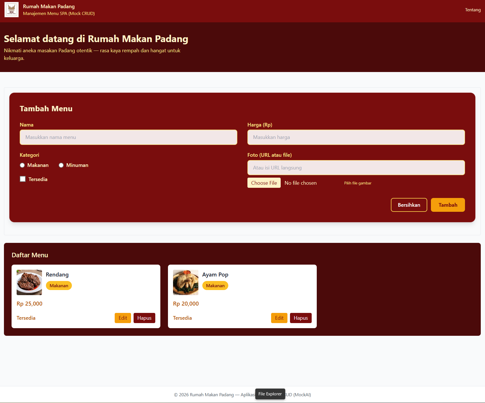
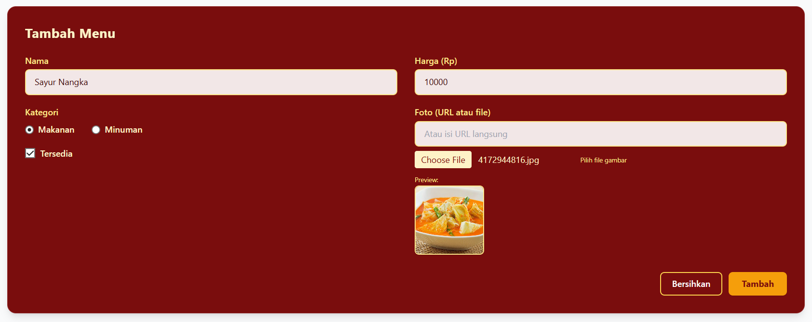
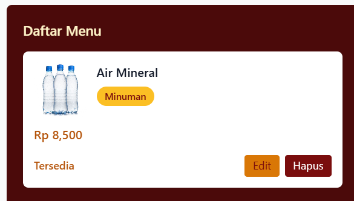
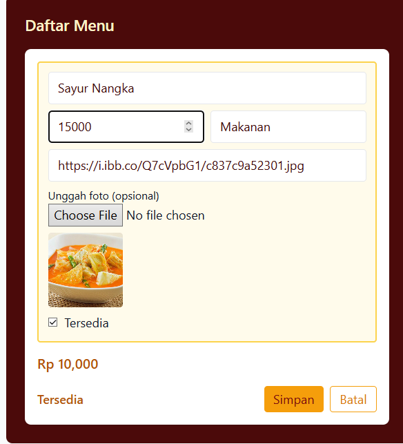
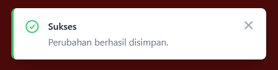
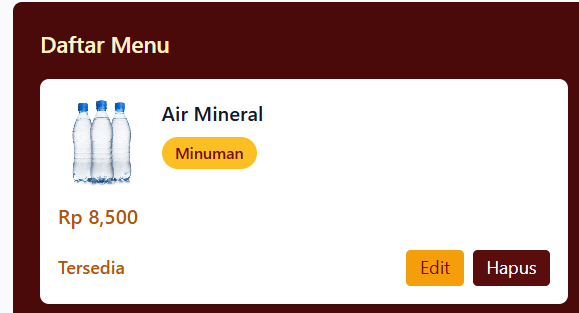
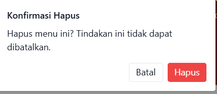

# UAS - SPA Manajemen Menu (Rumah Makan Padang)

Prototype Single Page Application (SPA) menggunakan Vue 3 (CDN) + Tailwind CSS (Play CDN). Aplikasi ini adalah *mock* CRUD (data disimpan in-memory) untuk keperluan UI dan demonstrasi fitur.


## Cara Install & Menjalankan

### 1. Install Dependensi

```bash
npm install
```

### 2. Jalankan Mode Development (Frontend & Backend Sekaligus)

```bash
npm run dev:all
```

Script ini akan otomatis menjalankan backend (Express, port 3000) dan frontend (Vite, port 5173) secara paralel. Anda cukup membuka http://localhost:5173 di browser.

### Alternatif Manual (Jika ingin terminal terpisah)

Terminal 1:
```bash
npm run server
```
Terminal 2:
```bash
npm run dev
```

### Build & Preview (Opsional untuk produksi)

```bash
npm run build
npm run preview
```

Untuk produksi, jalankan `npm start` (Express akan serve folder `dist`).

## Fitur yang telah disediakan

- Tampilan responsif dengan Tailwind CSS ✅
- Komponen modular: `Navbar`, `CardItem`, `FormInput`, `Footer` ✅
- Mock CRUD (Tambah, Edit, Hapus) — terhubung ke MockAPI endpoint (CRUD via network) ✅

**Endpoint:** `https://697b85bd0e6ff62c3c5c53d4.mockapi.io/Menu` (data dimuat saat aplikasi dibuka)


## Struktur Folder & File Penting

```
UAS-SinglePage-CRUD/
├── index.html
├── package.json
├── vite.config.js
├── tailwind.config.cjs
├── postcss.config.cjs
├── src/
│   ├── App.vue                # Root Vue SFC
│   ├── main.js                # Entry point Vite
│   ├── styles/
│   │   └── index.css          # Tailwind CSS entry
│   ├── components/
│   │   ├── Navbar.vue         # Header & branding
│   │   ├── CardItem.vue       # Kartu menu makanan/minuman
│   │   ├── FormInput.vue      # Form tambah/edit menu
│   │   ├── Footer.vue         # Footer aplikasi
│   │   └── Ornament.vue       # Ornamen SVG dekoratif
│   └── services/
│       └── imgbb.js           # Helper upload gambar ke ImgBB (via server proxy)
├── server/
│   ├── server.js              # Express server (proxy, upload, fallback)
│   ├── menu-store.js          # Fallback penyimpanan menu lokal (JSON)
│   └── data/
│       └── menu.json          # Data menu lokal (fallback)
├── image/
│   └── logo.png               # Logo aplikasi
└── README.md
```

## Arsitektur Aplikasi

- **Frontend:** Vue 3 (SFC), Vite, Tailwind CSS.
  - Komponen utama: Navbar, CardItem, FormInput, Footer, Ornament.
  - State dikelola dengan `reactive`/`ref` (tanpa Vuex).
  - Upload gambar: file diubah ke base64, dikirim ke backend (`/upload`), backend mengunggah ke ImgBB (Dokumentasi: https://api.imgbb.com), URL disimpan ke MockAPI.
  - Fallback: Jika MockAPI gagal, data menu disimpan/diambil dari file lokal (`server/data/menu.json`).

- **Backend:** Node.js + Express.
  - Proxy endpoint `/api/*` ke MockAPI.
  - Endpoint `/upload` untuk upload gambar ke ImgBB (menghindari expose API key di frontend).
  - Fallback CRUD: Jika MockAPI down, operasi CRUD dilakukan ke file lokal.
  - CORS diaktifkan untuk pengembangan.

- **Build Tools:** Vite (dev server, build), Tailwind CSS (utility-first styling), Nodemon (dev server backend).

---

Tidak ada autentikasi, aplikasi bersifat publik.
Semua perubahan menu langsung tersimpan ke MockAPI (atau fallback ke file lokal jika offline).
Logo dan tema warna menyesuaikan branding Rumah Makan Padang (maroon/emas).
Untuk upload gambar, gunakan file PNG/JPG, atau masukkan URL gambar langsung.

Lanjutkan dengan menjalankan `npm install` lalu `npm run server` dan `npm run dev` (di terminal terpisah) untuk memulai server dan dev frontend.

---

Menjalankan dengan Node (Express) + proxy ke MockAPI ✅

Untuk pengembangan (direkomendasikan):

1. Install dependensi:

   npm install

2a. Jalankan server API/proxy (Express) di terminal pertama:

   npm run server

   Server akan berjalan di http://localhost:3000 dan mem-proxy semua request `/api/*` ke MockAPI.

2b. Jalankan frontend dev server (Vite) di terminal kedua:

   npm run dev

   Vite dev server akan berjalan di http://localhost:5173 dan mem-proxy `/api` ke http://localhost:3000 (lihat `vite.config.js`).

Untuk produksi / preview build:

- Build: `npm run build` (membuat folder `dist`)
- Preview (Vite): `npm run preview` (opsional)
- Atau jalankan server Express untuk serve `dist`: `npm start` — server akan menyajikan folder `dist` jika ada.

Catatan: server entry adalah `server/server.js` (Express) — ia mem-proxy `/api/*` ke MockAPI. Aplikasi CRUD sekarang bersifat publik (tidak memerlukan login) sehingga Anda dapat membuat, memperbarui, dan menghapus menu secara langsung.

Data Schema (required fields)
- Setiap item `Menu` harus memenuhi skema berikut:
  - `nama` (String) — nama menu
  - `harga` (Number) — harga dalam Rupiah
  - `kategori` (String) — kategori menu
- `foto` (String) — URL ke foto (opsional, tapi disarankan); aplikasi menyediakan upload gambar ke ImgBB dan menyimpan URL hasil upload ke MockAPI.
- `isReady` (Boolean) — status ketersediaan (true = tersedia)

Catatan: MockAPI akan menyimpan fields seperti dikirim. Saat menambah/ubah item, Anda dapat memasukkan URL gambar langsung atau pilih file untuk diunggah — aplikasi akan mengunggah file ke ImgBB dan menggunakan URL yang dikembalikan.

## Usability Test (Screenshot)

Bagian ini menunjukkan alur penggunaan aplikasi melalui tangkapan layar (screenshot) untuk menguji fungsionalitas CRUD dan tampilan antarmuka.

### 1. Tampilan Awal Aplikasi

1. Buka aplikasi di browser Anda (misalnya, `http://localhost:5173` setelah menjalankan `npm run dev:all`). Anda akan melihat daftar menu yang sudah ada (jika ada) dan form untuk menambahkan menu baru.

<p align="center">
  
</p>

### 2. Menambah Menu

1. Pada form "Tambah Menu", isi kolom **Nama**, pilih **Kategori**, isi **Harga**, dan unggah **Foto** (opsional).

<p align="center">
  
</p>

2. Klik tombol **Tambah**. Menu baru akan ditambahkan ke daftar dan notifikasi "Sukses" akan muncul di pojok kanan atas. Form input akan otomatis bersih.

<p align="center">
  
</p>

### 3. Mengedit Menu (Inline Edit)

1. Klik tombol **Edit** pada salah satu kartu menu yang ingin diubah.

<p align="center">
  
</p>

2. Form input di bagian atas akan terisi dengan data menu tersebut. Lakukan perubahan yang diinginkan (misalnya, ubah harga atau nama menu).

<p align="center">
  
</p>

3. Klik tombol **Simpan Perubahan**. Perubahan pada menu akan tersimpan dan notifikasi "Sukses" akan muncul.

<p align="center">
  
</p>

### 4. Menghapus Menu

1. Klik tombol **Hapus** pada kartu menu yang ingin dihapus.

<p align="center">
  
</p>

2. Sebuah pop-up konfirmasi akan muncul. Periksa pesan konfirmasi.

<p align="center">
  
</p>

3. Klik tombol **Hapus** pada pop-up untuk melanjutkan. Menu akan dihapus dari daftar dan notifikasi "Sukses" akan muncul.

<p align="center">
  
</p>


## Refleksi Diri

### Tantangan Terbesar: Pergeseran Pola Pikir ke "Component-Based" dan "Reactivity"

Tantangan terbesar yang saya hadapi saat beralih dari HTML/JS standar ke framework modern (Vue.js) adalah mengubah cara berpikir dari **Imperatif** (memanipulasi DOM secara langsung, misal: `document.getElementById('app').innerHTML = ...`) menjadi **Deklaratif** (mendefinisikan *state* dan membiarkan framework memperbarui tampilan).

### Bagaimana Saya Menyelesaikannya:

1.  **Memecah UI Menjadi Komponen Kecil:** Awalnya saya bingung bagaimana membagi struktur kode. Saya mengatasinya dengan mulai mengisolasi bagian yang berulang seperti `CardItem` dan `Navbar`. Hal ini membuat kode jauh lebih bersih, terorganisir, dan mudah dikelola (maintainable) dibandingkan satu file HTML raksasa.
2.  **Memahami Reactivity (ref/reactive):** Konsep sinkronisasi otomatis antara data (JavaScript) dan tampilan (HTML) sempat membingungkan. Saya belajar untuk mempercayai sistem reaktif Vue—menggunakan `v-model` dan binding data—sehingga saya tidak perlu lagi menulis kode manual untuk memperbarui DOM setiap kali data berubah.
3.  **Manajemen State & Build Tools:** Beradaptasi dengan `npm` dan `Vite` sebagai build tools juga merupakan hal baru. Namun, fitur seperti *Hot Module Replacement* (HMR) sangat mempercepat proses development dibandingkan harus me-refresh browser secara manual setiap kali ada perubahan kecil.

Tugas UAS ini mengajarkan bahwa meskipun konfigurasi awal framework modern terasa lebih kompleks, hasil akhirnya adalah aplikasi yang jauh lebih *robust*, mudah dikembangkan, dan memberikan pengalaman pengguna (UX) yang lebih halus (SPA).